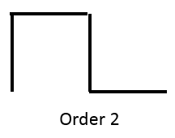

# A Fractal Dragon 

> A program that draws a shape called a dragon curve.

<a name="toc"/></a>
## Table of Contents

1. [Overview](#overview)

2. [Technologies](#technologies)

3. [Launch](#launch)

4. [Sample Output](#output)

5. [Source](#source)

<a name="overview"/></a>
## 1. Overview
[Back to ToC](#toc)

This is a program that draws a shape called a dragon curve. This is a linear fractal that connects two points. A particular dragon can be identified by a number corresponding to its complexity, called its rank or order.

The order-0 and order-1 dragons are shown below.


For order k > 1, the dragon is defined recursively. as shown in the diagram below:


The order k dragon between p1 and p3 consists of two order k-1 dragons, one between points p1 and p2 and the other between points p3 and p2. Thus the order-2 dragon looks like the image below. Note how each of the line segments in the order-1 dragon has been replaced by two shorter segments at a 90 degree angle; each of these is an order-1 dragon. The order-1 dragon itself is composed of two order-0 dragons, which are straight lines.



Given points p1 and p3, point p2 is found via some simple vector computations. Consider the vector p1p3 = (dx,dy). The perpendicular vector is (-dy,dx). Point p2 is thus p1+(dx/2-dy/2,dx/2+dy/2). 

A fractal dragon of order k is displayed using a recursive program.

Besides traditional fractal dragon. The project also included two others in `Seahorse.java` and `Snowflake.java`.  The fractal seahorse recursively replaces each segment with a three-segment unit.


The coordinates of the points p2 and p3 are given by these formulas:

    x2 = x1+dx/4-dy/4
    y2 = y1+dx/4+dy/4
    x3 = x4-dx/4+dy/4
    y3 = y4-dx/4-dy/4

The snowflake replaces each with a four-segment unit.

    x2 = x1+dx/3
    y2 = y1+dy/3
    x3 = x1+dx/2+dy*sqrt(3)/6
    y3 = y1-dx*sqrt(3)/6+dy/2
    x4 = x5-dx/3
    y4 = y5-dy/3

<a name="technologies"/></a>
## 2. Technologies
[Back to ToC](#toc)

java version "1.8.0_181"<br />
Java(TM) SE Runtime Environment (build 1.8.0_181-b13)<br />
Java HotSpot(TM) 64-Bit Server VM (build 25.181-b13, mixed mode)<br />

<a name="launch"/></a>
## 3. Launch
[Back to ToC](#toc)
```bash
javac -classpath .:target/dependency/* -d . $(find . -type f -name '*.java')

java Dragon <rank>
java Seahorse <rank>
java Snowflake <rank>
```
<a name="technologies"/></a>
## 4. Sample Output
[Back to ToC](#toc)

Dragon 
<p align="center">

</p>
Seahorse 
<p align="center">

</p>
Snowflake 
<p align="center">

</p>

## 5. Source
[Back to ToC](#toc)

This project uses Java Swing components developed by Professor Nick Howe to draw fractal figures.
